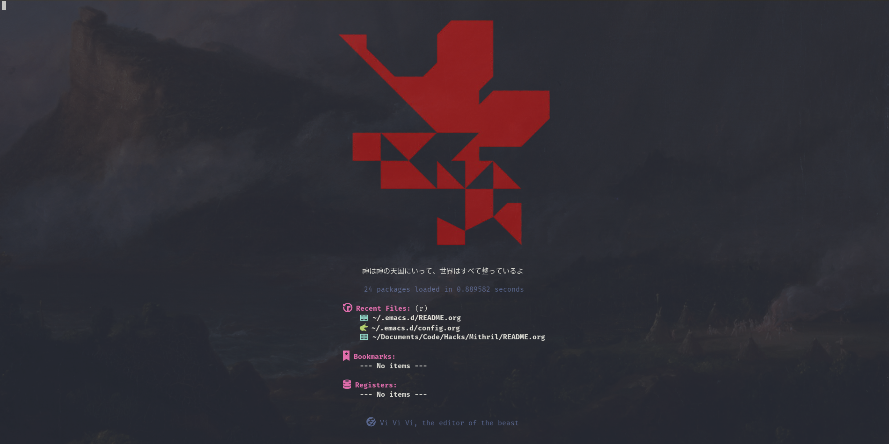

* My Literate Emacs Config

Everything lives in [[./config.org][config.org]] - the elisp is tangled out of it automatically on
startup, so that file is both the documentation and the config itself. The
keybinds guide at the top of it is the day-to-day reference.

** Install
#+begin_src sh
git clone --recurse-submodules git@github.com:EdwardoSunny/emacs-config.git ~/.emacs.d
~/.emacs.d/install_packages.sh
#+end_src

Then start Emacs. The first launch takes a few minutes: straight.el clones and
builds every elisp package on its own. When it settles, run
=M-x all-the-icons-install-fonts= and =M-x nerd-icons-install-fonts= once and
restart.

=install_packages.sh= covers the external tools the config shells out to:
pylsp/black/ipython as uv tools, plus cmake, libtool, ripgrep and clang-format.
Forgot =--recurse-submodules=? No problem - the config pulls the
[[https://github.com/EdwardoSunny/chronoscope.el][chronoscope]] submodule itself on first load.
